# ADAPT-Rehab System Workflow: End-to-End Analysis Pipeline

This artifact provides the detailed end-to-end system workflow for **ADAPT-Rehab v3.0**, reflecting the exact logic, algorithms, and parameters present in the codebase. It details how the dual input streams—**User Video** and **Reference Video**—are processed through sensing, perception, analysis, and coaching feedback loops.

---

## 1. System Pipeline Overview

```
                                              ┌────────────────────────────────┐
                                              │    Offline Reference Video     │
                                              └───────────────┬────────────────┘
                                                              │
                                                              ▼
                                              ┌────────────────────────────────┐
                                              │      Reference Pose & ROM      │
                                              └───────────────┬────────────────┘
                                                              │
                                                              ▼
┌─────────────────────────┐                   ┌────────────────────────────────┐
│   User Video / Webcam   │──────────────────►│  3D Pose Tracking (RTMW3D-L)   │
└───────────┬─────────────┘                   └───────────────┬────────────────┘
            │                                                 │
            ▼                                                 ▼
┌─────────────────────────┐                   ┌────────────────────────────────┐
│   OpenFace 3.0 / AUs    │                   │   Quaternion Kinematics (3D)   │
└───────────┬─────────────┘                   └───────────────┬────────────────┘
            │                                                 │
            ▼                                                 ▼
┌─────────────────────────┐                   ┌────────────────────────────────┐
│  Pain/Fatigue Indicators│                   │   Butterworth Low-pass Filter  │
└───────────┬─────────────┘                   └───────────────┬────────────────┘
            │                                                 │
            │                                                 ▼
            │                                 ┌────────────────────────────────┐
            │                                 │   Sakoe-Chiba Constrained DTW  │
            │                                 └───────────────┬────────────────┘
            │                                 │
            ▼                                 ▼
┌─────────────────────────┐                   ┌────────────────────────────────┐
│  Behavioral/Fatigue State◄──────────────────│  6-Dimension Scorer (Hold/Peak)│
└───────────┬─────────────┘                   └───────────────┬────────────────┘
            │                                                 │
            └────────────────────────┬────────────────────────┘
                                     │
                                     ▼
                      ┌─────────────────────────────┐
                      │    LLM Coach Context Builder│
                      └──────────────┬──────────────┘
                                     │
                                     ▼
                      ┌─────────────────────────────┐
                      │    LLM Rehab Coach & RAG    │
                      └──────────────┬──────────────┘
                                     │
                                     ▼
                      ┌─────────────────────────────┐
                      │  Edge-TTS Vietnamese Voice  │
                      └─────────────────────────────┘
```

The system splits execution into parallel pipelines for **Sensing & Preprocessing**, **Perception**, **Kinematics & Alignment**, **Physiological Scoring**, and **Intelligent Feedback Loops**. 

---

## 2. End-to-End Processing Steps & Mathematical Formulations

### Stage A: Input Streams & Calibration
1. **User Video Stream**: Captured in real-time ($30\text{ FPS}$) as frame sequence $\{I^U_t\}$.
2. **Reference Video Input**: Template video $\{I^R_k\}$ processed to extract standard joint angle trajectories.
3. **Safe-Max ROM Calibration (Webcam Phase)**:
   * **Process**: User performs $2\text{s}$ neutral standing followed by $5\text{s}$ maximum range of motion (ROM) per joint.
   * **Signal Conditioning**: Median filter ($w=5$) is applied to filter tremor. Outliers are rejected using a $\pm 2\sigma$ boundary from the mean.
   * **Threshold Extraction**: The user's safe limit is set at the 95th percentile ($\theta^U_{\text{user\_max}} = P_{95}(\Theta^U)$).
   * **Personalized Scaling Factor ($S$)**: 
     $$S = \text{clip}\left(\frac{\theta^U_{\text{user\_max}}}{\theta^R_{\text{ref\_max}}}, 0.5, 1.5\right)$$
     The reference target is scaled to the user's personal threshold: $\theta_{\text{target}} = S \cdot \theta^R_{\text{ref\_max}}$.

### Stage B: Perception Layer
1. **Whole-Body 3D Pose Estimation**: 
   * Handled by **RTMW3D-L** (fallback to MediaPipe if GPU is missing).
   * Outputs 133 3D keypoints: Body joints (0–16), feet (17–22), face (23–90), and hands (91–132).
2. **Face & Emotion Analysis**:
   * Analyzed via **OpenFace 3.0** (with a Face Mesh geometric fallback).
   * Extracts Action Units (AUs 1, 2, 4, 6, 9, 12, 25, 26), emotion labels (AffectNet), and gaze vectors.
   * **Pain Index ($\widetilde{\text{PSPI}}$)**:
     $$\widetilde{\text{PSPI}} = \text{AU4} + 2 \cdot \text{AU6} + \text{AU9} + 2 \cdot \text{AU43}_{\text{approx}}$$
     where $\text{AU43}_{\text{approx}}$ represents eye closure, estimated from the Eye Aspect Ratio (EAR).
   * **Fatigue Indicator ($F$)**:
     $$F = 0.35\,P_c + 0.25\,R_b + 0.25\,D_b + 0.15\,R_y$$
     where $P_c$ is PERCLOS (percentage of eye closure over 60s), $R_b$ is blink rate, $D_b$ is blink duration, and $R_y$ is yawn frequency.

### Stage C: Kinematics & Signal Alignment
1. **Quaternion Joint Angle Computation**:
   * Uses Melax (1998) formulation to avoid numerical instability of $\arccos$ near $0^\circ$ and $180^\circ$:
     $$s = \sqrt{2(1 + \mathbf{v}_1 \cdot \mathbf{v}_2)}, \quad w = \frac{s}{2}, \quad \theta_{\text{included}} = 2 \arccos(w)$$
   * Converts to ISB convention clinical angles: $\theta_{\text{clinical}} = 180^\circ - \theta_{\text{included}}$ for knee/elbow flexion.
2. **Signal Filtering**:
   * Filtered using a 4th-order Butterworth low-pass filter with a cutoff frequency of $6.0\text{ Hz}$.
3. **Sakoe-Chiba Constrained DTW**:
   * Warping window $w$ prevents mapping distortions:
     $$w = \max\left(\lfloor \max(n,m) \cdot 0.15 \rfloor, |n-m|, 5\right)$$
   * Aligns user angle profile $\Theta^U$ with reference profile $\Theta^R$. Calculates similarity score:
     $$\text{Similarity } (\%) = 100 \cdot e^{-3 \cdot d_{\text{norm}}}$$
     where $d_{\text{norm}}$ is the path-length-normalized DTW distance.

### Stage D: Multi-Dimensional Clinical Scoring
Scores are computed dynamically at the end of each repetition across six dimensions:
* **ROM Accuracy (25% weight)**: $40\%$ peak achievement vs target $+ 30\%$ hold ratio above $80\%$ target $+ 30\%$ peak region stability.
* **Stability (15% weight)**: Evaluated during the hold phase: $50\%$ standard deviation $+ 30\%$ oscillation count $+ 20\%$ drift penalty.
* **Flow (20% weight)**: Evaluates velocity profile smoothness, direction consistency (sign changes), and continuity (sudden jumps). If reference is loaded, matches the Constrained DTW score.
* **Symmetry (15% weight)**: Compares left-side vs right-side angle curves and maps deviation against reference asymmetry.
* **Compensation (15% weight)**: Detects shoulder hiking (threshold: $5\%$ frame height), trunk lean (threshold: $15^\circ$), and hip shift (threshold: $6\%$ height).
* **Smoothness (10% weight)**: Combures $60\%$ SPARC (Spectral Arc Length of Fourier velocity spectrum) and $40\%$ LDLJ (Log-Dimensionless Jerk).
* **Fatigue Analysis**: Evaluates Jerk Ratio (current jerk / baseline jerk), ROM degradation, velocity decline, and movement variability.

### Stage E: Intelligent LLM Coach & Voice Feedback
* **Context Prompt Builder**: Combines joint angle curves, 6-D scores, active compensation events, pain PSPI level, fatigue $F$ level, and user profile data into a single structured prompt.
* **LLM Rehab Coach (with RAG)**: Matches user state against a Clinical Rehabilitation Knowledge Base. Applies strict safety guardrails (e.g., blocking instructions to "push through pain").
* **Edge-TTS Neural Voice**: Converts generated Vietnamese feedback to speech using `vi-VN-HoaiMyNeural`.

---

## 3. Detailed Horizontal Mermaid Diagram

This Mermaid flowchart visualizes the data transformations horizontally, displaying parameters, weights, and formulas at each stage.

```mermaid
graph LR
    %% Styles and Themes
    classDef input fill:#F4F6F7,stroke:#2C3E50,stroke-width:2px,color:#1B2631;
    classDef process fill:#FFFFFF,stroke:#566573,stroke-width:1.5px,color:#1B2631;
    classDef perception fill:#D9E2F3,stroke:#1F4E79,stroke-width:2px,color:#1B2631;
    classDef evaluation fill:#FADBD8,stroke:#C0392B,stroke-width:2px,color:#1B2631;
    classDef output fill:#EAFAF1,stroke:#27AE60,stroke-width:2px,color:#1B2631;

    %% STAGE 1: INPUTS
    subgraph ST1 [1. Input Streams]
        U_VID["User Video Stream<br/>(Webcam 30 FPS)"]:::input
        R_VID["Reference Video<br/>(Exercise Template)"]:::input
        U_CAL["Safe-Max ROM Calibration<br/>(Neutral & Max ROM)"]:::input
    end

    %% STAGE 2: PERCEPTION
    subgraph ST2 [2. Perception Layer]
        RTMW["RTMW3D-L Model<br/>(133 Keypoints)"]:::perception
        FACE["OpenFace 3.0<br/>(Action Units 1-26)"]:::perception
        CAL_PROC["Calibration Processor<br/>(Median Filter & Outliers)"]:::perception
    end

    %% STAGE 3: KINEMATICS & ALIGNMENT
    subgraph ST3 [3. Kinematics & Alignment]
        QUAT["Quaternion Kinematics<br/>(Melax Formulation)"]:::process
        BUTT["Butterworth Filter<br/>(4th-Order, 6Hz Cutoff)"]:::process
        DTW["Constrained DTW<br/>(Sakoe-Chiba Band)"]:::process
        PAIN_FAT["Pain & Fatigue Analysis<br/>(PSPI & PERCLOS Indices)"]:::process
    end

    %% STAGE 4: CLINICAL SCORING
    subgraph ST4 [4. Physiological Evaluation]
        SCORER["6-Dimensional Scorer<br/>(Weighted Metrics)"]:::evaluation
        COMP["Compensation Detector<br/>(Hiking / Lean / Shift)"]:::evaluation
        FAT_ANA["Fatigue Trend Analyzer<br/>(Jerk Ratio & ROM Drop)"]:::evaluation
    end

    %% STAGE 5: INTELLIGENCE & COACHING
    subgraph ST5 [5. Intelligent Coaching]
        RAG["LLM Context Builder<br/>(RAG Clinical Guidelines)"]:::output
        LLM["LLM Coach & Guardrails<br/>(Prompt Safety Verification)"]:::output
        TTS["Edge-TTS Engine<br/>(Vietnamese Neural Voice)"]:::output
        DASH["HUD Overlay & Dashboard<br/>(Skeleton & ROM Arcs)"]:::output
    end

    %% Connections
    U_VID --> RTMW
    U_VID --> FACE
    R_VID --> RTMW
    U_CAL --> CAL_PROC

    RTMW --> QUAT
    FACE --> PAIN_FAT
    CAL_PROC --> |"Personal Scale Factor (S)"| DTW

    QUAT --> BUTT
    BUTT --> |"User Angles"| DTW
    BUTT --> |"Symmetry / Smoothness"| SCORER

    DTW --> |"DTW Similarity (Flow)"| SCORER
    PAIN_FAT --> |"Pain & Fatigue Metrics"| FAT_ANA
    RTMW --> |"Skeleton Sequence"| COMP

    SCORER --> RAG
    COMP --> |"Active Penalties"| SCORER
    FAT_ANA --> RAG

    RAG --> LLM
    LLM --> TTS
    LLM --> DASH
    TTS --> DASH

    %% Feedback loop
    PAIN_FAT -.-> |"Immediate Pain Adapt Loop (Red Alert)"| LLM
```



---

## 4. Publication-Ready LaTeX TikZ Diagram Code

Below is the complete, compile-ready LaTeX TikZ code for a horizontal workflow block diagram, formatted for double-column figures in IEEE Transactions style. You can write this code into a standalone file (e.g., `fig1_workflow_horizontal.tex`) and compile it using `pdflatex`.

```latex
% =============================================================================
%  ADAPT-Rehab -- IEEE Double-Column Horizontal System Workflow Diagram
%  Compile: pdflatex fig1_workflow_horizontal.tex
% =============================================================================
\documentclass[tikz,border=5pt]{standalone}
\usepackage[T1]{fontenc}
\usepackage[scaled]{helvet}
\renewcommand{\familydefault}{\sfdefault}
\usetikzlibrary{positioning,arrows.meta,calc,fit,backgrounds,shapes.misc}

% --- Custom IEEE Color Palette (Hex Codes) -----------------------------------
\definecolor{AccentBlue}{HTML}{1F4E79}
\definecolor{AccentBlueFill}{HTML}{D9E2F3}
\definecolor{AccentRed}{HTML}{C0392B}
\definecolor{AccentRedFill}{HTML}{FADBD8}
\definecolor{NeutralBorder}{HTML}{2C3E50}
\definecolor{NeutralColFill}{HTML}{F4F6F7}
\definecolor{NeutralMid}{HTML}{566573}
\definecolor{TextMain}{HTML}{1B2631}
\definecolor{TextSub}{HTML}{566573}
\definecolor{White}{HTML}{FFFFFF}

% --- Layout Constants --------------------------------------------------------
\newcommand{\colW}{3.5}     % Column width
\newcommand{\colH}{7.8}     % Column height
\newcommand{\colGap}{0.55}  % Column horizontal gap
\newcommand{\boxW}{3.1}     % Box width
\newcommand{\boxH}{1.0}     % Box height
\newcommand{\titleH}{0.6}   % Column title height

% --- Component Box Helper Macro ----------------------------------------------
\newcommand{\compbox}[5][]{%
  \node[rounded corners=4pt, draw=NeutralBorder, line width=1pt,
        fill=White, minimum width=\boxW cm, minimum height=\boxH cm,
        align=center, text=TextMain, font=\bfseries\small, #1]
        (tmp) at (#2,#3) {};
  \node[align=center, text=TextMain, font=\bfseries\footnotesize]
        at ($(tmp.north)+(0,-0.3)$) {#4};
  \node[align=center, text=TextSub, font=\scriptsize\itshape]
        at ($(tmp.south)+(0,0.3)$) {#5};
}

\begin{document}
\begin{tikzpicture}[
    >={Stealth[length=6pt,width=5pt]},
    column/.style={
        rounded corners=5pt, draw=NeutralMid, line width=1pt,
        fill=NeutralColFill, minimum width=\colW cm, minimum height=\colH cm,
        inner sep=0pt, anchor=south west
    },
    perceptionColumn/.style={
        rounded corners=5pt, draw=AccentBlue, line width=1.6pt,
        fill=AccentBlueFill, minimum width=\colW cm, minimum height=\colH cm,
        inner sep=0pt, anchor=south west
    },
    titleBar/.style={
        rounded corners=4pt, draw=AccentBlue, line width=0.9pt,
        fill=AccentBlue, minimum width=\colW cm, minimum height=\titleH cm,
        align=center, text=White, font=\bfseries\small, anchor=south west
    },
    titleBarNeutral/.style={
        rounded corners=4pt, draw=NeutralMid, line width=0.9pt,
        fill=NeutralMid, minimum width=\colW cm, minimum height=\titleH cm,
        align=center, text=White, font=\bfseries\small, anchor=south west
    }
  ]

  % --- Column coordinates (5 Columns) ---
  \def\xA{0}
  \def\xB{\colW+\colGap}
  \def\xC{2*(\colW+\colGap)}
  \def\xD{3*(\colW+\colGap)}
  \def\xE{4*(\colW+\colGap)}
  \def\yTop{0}
  \def\yBot{-\colH}

  % --- Background Columns ---
  \node[column]            (C1) at (\xA, \yBot) {};
  \node[perceptionColumn]  (C2) at (\xB, \yBot) {};
  \node[column]            (C3) at (\xC, \yBot) {};
  \node[column]            (C4) at (\xD, \yBot) {};
  \node[column]            (C5) at (\xE, \yBot) {};

  % --- Column Header Titles ---
  \node[titleBarNeutral]   (T1) at (\xA, \yTop-\titleH) {1. SENSING \& INPUTS};
  \node[titleBar]          (T2) at (\xB, \yTop-\titleH) {2. PERCEPTION};
  \node[titleBarNeutral]   (T3) at (\xC, \yTop-\titleH) {3. KINEMATICS \& ALIGN};
  \node[titleBarNeutral]   (T4) at (\xD, \yTop-\titleH) {4. EVALUATION};
  \node[titleBarNeutral]   (T5) at (\xE, \yTop-\titleH) {5. COACHING \& HUD};

  % --- Modality dividers in Perception Column (Dashed hairlines) ---
  \draw[NeutralMid, line width=0.6pt, dash pattern=on 3pt off 3pt]
       ($(C2.north west)+(0.15,-2.5)$) -- ($(C2.north east)+(-0.15,-2.5)$);
  \draw[NeutralMid, line width=0.6pt, dash pattern=on 3pt off 3pt]
       ($(C2.north west)+(0.15,-4.9)$) -- ($(C2.north east)+(-0.15,-4.9)$);

  % Modality Label tags inside Perception
  \node[font=\scriptsize\bfseries\itshape, text=AccentBlue, anchor=east]
       at ($(C2.north east)+(-0.12,-0.95)$) {Body};
  \node[font=\scriptsize\bfseries\itshape, text=AccentBlue, anchor=east]
       at ($(C2.north east)+(-0.12,-3.0)$) {Face};
  \node[font=\scriptsize\bfseries\itshape, text=AccentBlue, anchor=east]
       at ($(C2.north east)+(-0.12,-5.3)$) {Audio};

  % ===========================================================================
  %  STAGE COMPONENT BOXES
  % ===========================================================================

  % --- Column 1 -- SENSING & INPUTS ---
  \compbox{\xA+\colW/2}{-1.75}{User Video / Webcam}{30 FPS RGB Frame Stream}
  \compbox{\xA+\colW/2}{-3.85}{Reference Template}{Exercise Angular Dataset}
  \compbox{\xA+\colW/2}{-5.95}{Safe-Max ROM Calibration}{2s Neutral + 5s Max ($P_{95}$)}

  % --- Column 2 -- PERCEPTION ---
  \compbox{\xB+\colW/2}{-1.75}{RTMW3D-L Model}{133 3D Keypoint Extraction}
  \compbox{\xB+\colW/2}{-3.85}{OpenFace 3.0 Engine}{Action Units (8 AUs) + Gaze}
  \compbox{\xB+\colW/2}{-5.95}{Whisper ASR Model}{Speech-to-Text Fallback}

  % --- Column 3 -- KINEMATICS & ALIGN ---
  \compbox{\xC+\colW/2}{-1.75}{Quaternion Kinematics}{Melax Robust included angle}
  \compbox{\xC+\colW/2}{-3.85}{Butterworth Filter}{4th-Order, 6.0 Hz Cutoff}
  \compbox{\xC+\colW/2}{-5.95}{Constrained DTW}{Sakoe-Chiba Band (15\% width)}

  % --- Column 4 -- EVALUATION ---
  \compbox{\xD+\colW/2}{-1.75}{6-Dimension Scorer}{ROM (25\%) + Stability (15\%)}
  \compbox{\xD+\colW/2}{-3.85}{Compensation Detector}{Shoulder Hiking + Trunk Lean}
  \compbox{\xD+\colW/2}{-5.95}{Fatigue Analyzer}{Jerk Ratio + ROM Degradation}

  % --- Column 5 -- COACHING & HUD ---
  \compbox{\xE+\colW/2}{-1.75}{LLM Coach \& RAG}{Clinical KB + Safety Guardrails}
  \compbox{\xE+\colW/2}{-3.85}{Edge-TTS Speech Synth}{vi-VN-HoaiMyNeural Voice}
  \compbox{\xE+\colW/2}{-5.95}{Visual HUD & Dashboard}{2D skeleton overlay + ROM arcs}

  % ===========================================================================
  %  ROUTING / CONNECTION ARROWS
  % ===========================================================================
  
  % Main Flow Arrows (y = -3.2)
  \draw[NeutralMid, line width=1.5pt, -{Stealth[length=6pt,width=5pt]}]
       ($(C1.east)+(0,-3.2)$) -- ($(C2.west)+(0,-3.2)$);
  \draw[NeutralMid, line width=1.5pt, -{Stealth[length=6pt,width=5pt]}]
       ($(C2.east)+(0,-3.2)$) -- ($(C3.west)+(0,-3.2)$);
  \draw[NeutralMid, line width=1.5pt, -{Stealth[length=6pt,width=5pt]}]
       ($(C3.east)+(0,-3.2)$) -- ($(C4.west)+(0,-3.2)$);
  \draw[NeutralMid, line width=1.5pt, -{Stealth[length=6pt,width=5pt]}]
       ($(C4.east)+(0,-3.2)$) -- ($(C5.west)+(0,-3.2)$);

  % Arrow Labels
  \node[font=\scriptsize\bfseries, text=TextMain, fill=White, inner sep=1.5pt]
       at ($(C1.east)!0.5!(C2.west) + (0,0.25)$) {RGB feed};
  \node[font=\scriptsize\bfseries, text=TextMain, fill=White, inner sep=1.5pt]
       at ($(C2.east)!0.5!(C3.west) + (0,0.25)$) {Keypoints};
  \node[font=\scriptsize\bfseries, text=TextMain, fill=White, inner sep=1.5pt]
       at ($(C3.east)!0.5!(C4.west) + (0,0.25)$) {Aligned Angles};
  \node[font=\scriptsize\bfseries, text=TextMain, fill=White, inner sep=1.5pt]
       at ($(C4.east)!0.5!(C5.west) + (0,0.25)$) {6-D Scores};

  % Internal Module Sub-routing Arrows
  \draw[NeutralMid, line width=0.8pt, ->] ($(C1.east)+(0,-5.95)$) -- +(0.15,0) |- ($(C3.west)+(0,-5.95)$);
  \draw[NeutralMid, line width=0.8pt, ->] ($(C2.east)+(0,-1.75)$) -- ($(C3.west)+(0,-1.75)$);
  \draw[NeutralMid, line width=0.8pt, ->] ($(C2.east)+(0,-3.85)$) -- +(0.15,0) |- ($(C3.west)+(0,-4.5)$);
  \draw[NeutralMid, line width=0.8pt, ->] ($(C3.east)+(0,-1.75)$) -- ($(C4.west)+(0,-1.75)$);
  \draw[NeutralMid, line width=0.8pt, ->] ($(C3.east)+(0,-5.95)$) -- +(0.15,0) |- ($(C4.west)+(0,-5.95)$);
  \draw[NeutralMid, line width=0.8pt, ->] ($(C4.east)+(0,-1.75)$) -- ($(C5.west)+(0,-1.75)$);
  \draw[NeutralMid, line width=0.8pt, ->] ($(C4.east)+(0,-5.95)$) -- +(0.15,0) |- ($(C5.west)+(0,-5.95)$);

  % Active feedback loops (Pain/Fatigue alerts to Coach, red dashed line)
  \coordinate (FBstart) at ($(C5.south)+(0,-0.12)$);
  \coordinate (FBend)   at ($(C4.south)+(0,-0.12)$);
  \draw[AccentRed, line width=1.4pt, dash pattern=on 5pt off 4pt, -{Stealth[length=6pt,width=5pt]}]
        (FBstart) .. controls +(0,-1.3) and +(0,-1.3) .. (FBend);
  \node[font=\scriptsize\bfseries\itshape, text=AccentRed, fill=White, inner sep=2pt]
        at ($(FBstart)!0.5!(FBend)+(0,-1.1)$) {Pain \& Fatigue Loop $\rightarrow$ Dynamic Coach Adjust};

\end{tikzpicture}
\end{document}
```
